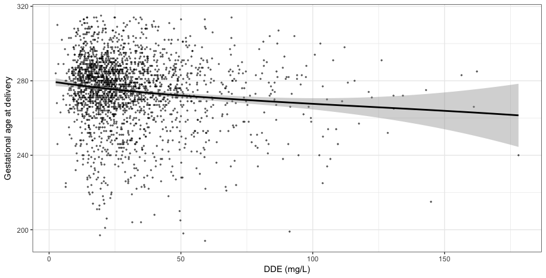
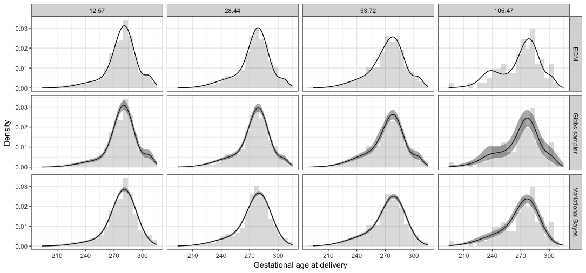
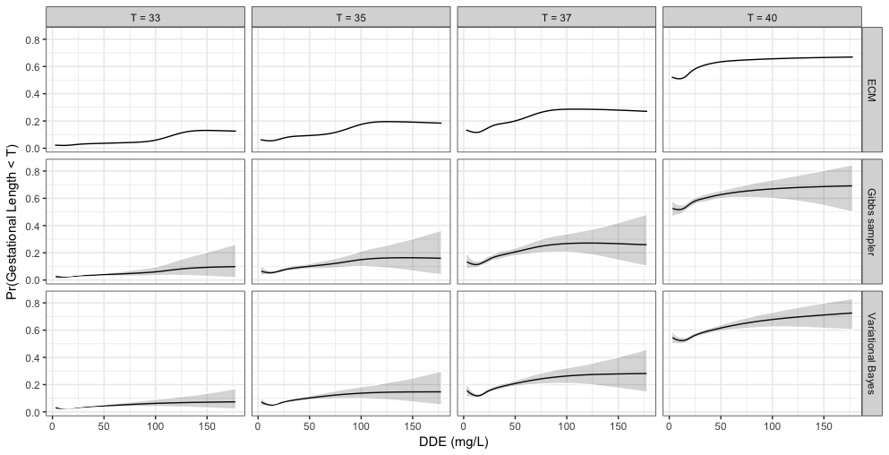

In this tutorial we describe the steps for obtaining the results of the epidemiology application of Section 4 of the paper, in order to make them fully reproducible.

All the analyses are performed with a **MacBook Air (OS X Sierra, version 10.12.6)**, using a R version **3.4.1**. Notice that matrix decompositions involved in this code might differ across operating systems. 

The code described below requires the installation of the `LSBP` R package, available in this repository. See the [README](https://github.com/blindedmanuscript/LSBP/blob/master/README.md) for instructions on the installation.

As a preliminary step, we load on a clean the environment all the required libraries.

```r
rm(list=ls())    # Clean the current session
library(LSBP)    # Load the LSBP package
library(ggplot2) # Graphical library
library(coda)    # For MCMC analysis
library(splines) # For computing the natural B-splines basis
```

## Dataset description

```r
load("dde.RData") # Load the dataset in memory
```

The `dde` dataset can be downloaded [from this respository](dde.RData). It contains a `data.frame` having two columns: 

* `DDE`: the level of the Dichlorodiphenyldichloroethylene.
* `GAD`: the gestational age at delivery, in days.

The dataset comprises a total of `2312` observations. The `DDE` is clearly related to the gestational age at delivery, as suggested by the scatterplot shown below; the smooth line is a loess estimate. 

```r
ggplot(data=dde, aes(x=DDE,y=GAD)) + geom_point(alpha=.5, cex=.5) + geom_smooth( method="loess", span = 1, col=1) + xlab("DDE (mg/L)") + ylab("Gestational age at delivery") + theme_bw() 
```



## LSBP estimation

To fit the LSBP model we first define some fixed quantities, like the number MCMC replications, the burn-in period and the number of mixture components `H`. 

```r
n         <- nrow(dde) # Number of observations
p         <- 2         # Row and colums of the design for the kernel
p_splines <- 5         # Number of splines components
R         <- 30000     # Number of replications
burn_in   <- 5000      # Burn-in period
H         <- 5         # Number of mixture components
```

Using the function `prior_LSBP` we can specify the prior distribution, in the correct format. Also, notice that both `GAD` and `DDE` have been normalized. 

For the mixing components, we use a natural cubic splines basis with $4$ equally spaced inner knots, obtained through the `ns` command of the `splines` package. As a result, for each mixture component we have $5$ parameters that have to be estimated.


```r
prior       <- prior_LSBP(p,p, 
                      b_mixing = rep(0,p_splines+1), B_mixing=diag(1,p_splines+1), 
                      b_kernel = c(0,0), B_kernel=diag(1,p), 
                      a_tau = .1, b_tau= .1)

# Creation of the normalized dataset
dde_scaled  <- data.frame(scale(dde))
Basis       <- ns(dde_scaled$DDE,p_splines)
dde_scaled  <- data.frame(dde_scaled, BS=Basis)

# Formula for the model
model_formula <- Formula::as.Formula(GAD ~ DDE | BS.1 + BS.2 + BS.3 + BS.4 + BS.5)
```

### Gibbs sampling algorithm

We first run the Gibbs sampling using the command `LSBP_Gibbs` of the `LSBP` package.

```r
set.seed(10) # The seed is setted so that the Gibbs sampler is reproducible.
fit_Gibbs   <- LSBP_Gibbs(model_formula, data=dde_scaled, H=H, prior=prior,
                          control=control_Gibbs(R=R,burn_in=burn_in), verbose=FALSE)
```

### ECM algorithm

To alleviate the issue of local maxima, we run the ECM algorithm `10` times through the command `LSBP_ECM` of the `LSBP` package, and we select the model that reached the highest value of the log-posterior distribution.

```r
logposterior <- rep(0,10)
for(i in 1:10){
  set.seed(i) # Every time we run the algorithm, we set a seed varying with i
  fit_ECM   <- LSBP_ECM(model_formula, data=dde_scaled, H=H, prior=prior,
                        control=control_ECM(method_init = "random"), verbose=FALSE)
  logposterior[i]  <- fit_ECM$logposterior
}

# Then, we run the algorithm again selecting the seed having the maximum log-posterior
set.seed(which.max(logposterior))
fit_ECM   <- LSBP_ECM(model_formula, data=dde_scaled, H=H, prior=prior,
                        control=control_ECM(method_init = "random"), verbose=FALSE)
```

### Variational Bayes algorithm

As for the ECM algorithm, also the variational Bayes approach suffers the issue of local maxima. Therefore, we run the algorithm `10` times, selecting the one having the highest lower bound.

```r
# VB algorithm
lower_bound <- rep(0,10)
for(i in 1:10){
  set.seed(i)
  fit_VB         <- LSBP_VB(model_formula, data=dde_scaled, H=H, prior=prior,
                       control_VB(tol=1e-2,method_init="random"),verbose=FALSE)
  lower_bound[i] <- fit_VB$lowerbound
}

set.seed(which.max(lower_bound))
fit_VB   <- LSBP_VB(model_formula, data=dde_scaled, H=H, prior=prior,
                       control_VB(tol=1e-2,method_init="random"),verbose=FALSE)
```

## Conditional densities

We first create some auxiliary quantities that will be useful during this 

```r
# Points for which we will evaluate
DDE.points  <- (round(quantile(dde$DDE,c(0.1,0.6,0.9,0.99)),2) - mean(dde$DDE))/sd(dde$DDE)

# And the correspondings design matrices
X1           <- cbind(1,DDE.points)             # Design matrix for the kernel
X2           <- cbind(1,ns(DDE.points,          # Design matrix for the stick-breaking weights
                                    knots=attr(Basis,"knots"),
                                    Boundary.knots=attr(Basis,"Boundary.knots")))
# Sequence for AGE and DDE
sequenceGAD <- seq(from=min(dde_scaled$GAD),to=max(dde_scaled$GAD),length=100)
sequenceDDE <- seq(from=min(dde_scaled$DDE),to=max(dde_scaled$DDE),length=100)

# Create a new dataset containing the values to be predicted
newdata     <- data.frame(GAD=0, DDE=sequenceDDE, 
                          BS= ns(sequenceDDE,knots=attr(Basis,"knots"),Boundary.knots=attr(Basis,"Boundary.knots")))
```

In the following chunks it is reported the code necessary for obtaining the conditional density for the three algorithms, using the function `LSBP_density` of the `LSBP` package, which evaluates the conditional density of a logit stick-breaking model.

For the Gibbs sampler, the conditional density is evaluated for different `GAD` values, for each MCMC replication.
```r
# Posterior density - Gibbs sampling
pred_Gibbs <- array(0,c(R,length(sequenceGAD),4))
for(r in 1:R){      # Cycle over the iterations of the MCMC chain
  for(i in 1:100){  # Cycle over the GAD grid
    pred_Gibbs[r,i,] <- c(LSBP_density(sequenceGAD[i],X1,X2,
                          fit_Gibbs$param$beta_mixing[r,,],
                          fit_Gibbs$param$beta_kernel[r,,],
                          fit_Gibbs$param$tau[r,]))/sd(dde$GAD)
  }
}

# Computing posterior means and posterior quantiles
estimate_Gibbs <- apply(pred_Gibbs,c(2,3),mean)
lower_Gibbs    <- apply(pred_Gibbs,c(2,3),function(x) quantile(x,0.025))
upper_Gibbs    <- apply(pred_Gibbs,c(2,3),function(x) quantile(x,0.975))
```

Similarly, for the ECM algorithm we plug-in the MAP estimate into the conditional density

```r
# Posterior density estimate for the ECM model
estimate_ECM <- matrix(0,length(sequenceGAD),4)
for(i in 1:100){       # Cycle over the GAD grid
  estimate_ECM[i,] <- c(LSBP_density(sequenceGAD[i],X1,X2,
                       fit_ECM$param$beta_mixing,
                       fit_ECM$param$beta_kernel,
                       fit_ECM$param$tau))/sd(dde$GAD)
}

```

Finally, we compute the posterior conditional density also for the VB approximation. We need first to sample values from the variational approximation: we will then compute the conditional density at each sampled value, thus obtaining a sample from the conditional density.

```r
set.seed(123)

# Posterior density estimate for the VB model
fit_VB$beta_mixing_sim <- array(0, c(R, H - 1, p_splines+1))
fit_VB$beta_kernel_sim <- array(0, c(R, H, p))
fit_VB$tau_sim         <- matrix(0, R, H)

# Generating values from the VB approximation
for (h in 1:H) {
        if (h < H) {
            eig <- eigen(fit_VB$param$Sigma_mixing[h, , ], symmetric = TRUE)
            A1 <- t(eig$vectors) * sqrt(eig$values)
            fit_VB$beta_mixing_sim[, h, ] <- t(fit_VB$param$mu_mixing[h, ] + t(matrix(rnorm(R * (p_splines+1)), R, p_splines+1) %*% A1))
         }
         eig <- eigen(fit_VB$param$Sigma_kernel[h, , ], symmetric = TRUE)
         A1  <- t(eig$vectors) * sqrt(eig$values)
         fit_VB$beta_kernel_sim[, h, ] <- t(fit_VB$param$mu_kernel[h, ] + t(matrix(rnorm(R * p), R, p) %*% A1))
         fit_VB$tau_sim[, h] <- rgamma(R, fit_VB$param$a_tilde[h], fit_VB$param$b_tilde[h])
}

# Posterior density - VB
pred_VB <- array(0,c(R,length(sequenceGAD),4))
for(r in 1:R){      # Cycle over the R simulations of the previous step
  for(i in 1:100){  # Cycle over the GAD grid
    pred_VB[r,i,] <- c(LSBP_density(sequenceGAD[i],X1,X2,
                          fit_VB$beta_mixing_sim[r,,],
                          fit_VB$beta_kernel_sim[r,,],
                          fit_VB$tau_sim[r,]))/sd(dde$GAD)
  }
}

# Posterior mean and quantiles
estimate_VB <- apply(pred_VB,c(2,3),mean)
lower_VB    <- apply(pred_VB,c(2,3),function(x) quantile(x,0.025))
upper_VB    <- apply(pred_VB,c(2,3),function(x) quantile(x,0.975))
```

The construction of Figure 4 of the paper proceeds as follows

```r
# Construction of the data_frame - Notice that the values are reconducted to the original scale.
data.plot <- data.frame(
  prediction  = c(c(estimate_Gibbs),c(estimate_ECM),c(estimate_VB)),
  lower       = c(c(lower_Gibbs),rep(NA,100*4),c(lower_VB)),
  upper       = c(c(upper_Gibbs),rep(NA,100*4),c(upper_VB)),
  sequenceGAD = rep(sequenceGAD,3*4)*sd(dde$GAD) + mean(dde$GAD),
  DDE.points  = rep(rep(DDE.points,each=100),3)*sd(dde$DDE)+ mean(dde$DDE),
  Algorithm   = c(rep("Gibbs sampler",4*100),rep("ECM",4*100),rep("Variational Bayes",4*100))
)


data.plot2 <- data.frame(
  GAD = rep(c(dde$GAD[which(dde$DDE < 20.505)],
        dde$GAD[which(dde$DDE >= 20.505 & dde$DDE < 41.08)],
        dde$GAD[which(dde$DDE >= 41.08 & dde$DDE < 79.6)],
        dde$GAD[which(dde$DDE > 79.6)]),3),
  DDE.points = rep(c(rep(12.57,sum(dde$DDE < 20.505)),
        rep(28.44,sum(dde$DDE >= 20.505 & dde$DDE < 41.08)),
        rep(53.72,sum(dde$DDE >= 41.08 & dde$DDE < 79.6)),
        rep(105.47,sum(dde$DDE > 79.6))),3),
  Algorithm = c(rep("Gibbs sampler",nrow(dde)),rep("ECM",nrow(dde)),rep("Variational Bayes",nrow(dde)))
)

ggplot(data=data.plot) + geom_line(aes(x=sequenceGAD,y=prediction)) + facet_grid(Algorithm~ DDE.points,scales="free_y") + ylab("Density") + geom_ribbon(alpha=0.4,aes(x=sequenceGAD,ymin=lower,ymax=upper))  +xlab("Gestational age at delivery") + geom_histogram(data=data.plot2,aes(x=GAD,y=..density..),alpha=0.2,bins=25) + theme_bw()
```



## Conditional probabilities of being under a threshold

Finally, we produce the conditional probability of being under a threshold T of Figure 5 of the paper

```r
# Notice that the GAD and DDE values are reconducted to the original scale.
gibbs_cdf <- cbind(predict(fit_Gibbs,type="cdf",threshold=(33*7 - mean(dde$GAD))/sd(dde$GAD),newdata=newdata),
               predict(fit_Gibbs,type="cdf",threshold=(35*7 - mean(dde$GAD))/sd(dde$GAD),newdata=newdata),
               predict(fit_Gibbs,type="cdf",threshold=(37*7 - mean(dde$GAD))/sd(dde$GAD),newdata=newdata),
               predict(fit_Gibbs,type="cdf",threshold=(40*7 - mean(dde$GAD))/sd(dde$GAD),newdata=newdata))

vb_cdf    <- cbind(predict(fit_VB,type="cdf",threshold=(33*7 - mean(dde$GAD))/sd(dde$GAD),newdata=newdata),
               predict(fit_VB,type="cdf",threshold=(35*7 - mean(dde$GAD))/sd(dde$GAD),newdata=newdata),
               predict(fit_VB,type="cdf",threshold=(37*7 - mean(dde$GAD))/sd(dde$GAD),newdata=newdata),
               predict(fit_VB,type="cdf",threshold=(40*7 - mean(dde$GAD))/sd(dde$GAD),newdata=newdata))

ECM_cdf   <- c(predict(fit_ECM,type="cdf",threshold=(33*7 - mean(dde$GAD))/sd(dde$GAD),newdata=newdata),
               predict(fit_ECM,type="cdf",threshold=(35*7 - mean(dde$GAD))/sd(dde$GAD),newdata=newdata),
               predict(fit_ECM,type="cdf",threshold=(37*7 - mean(dde$GAD))/sd(dde$GAD),newdata=newdata),
               predict(fit_ECM,type="cdf",threshold=(40*7 - mean(dde$GAD))/sd(dde$GAD),newdata=newdata))
               
data.cdf  <- data.frame(DDE=rep(sequenceDDE,3*4)*sd(dde$DDE) + mean(dde$DDE),
                        Algorithm=rep(c("ECM","Gibbs sampler","Variational Bayes"),each=4*length(sequenceDDE)),
                        CDF  = c(ECM_cdf,colMeans(gibbs_cdf),colMeans(vb_cdf)),
                        Threshold = rep(rep(c("T = 33","T = 35","T = 37","T = 40"),each=length(sequenceDDE)),3),
                        Upper = c(rep(NA,4*length(sequenceDDE)),
                                  apply(gibbs_cdf,2,function(x) quantile(x,0.975)),
                                  apply(vb_cdf,2,function(x) quantile(x,0.975))),
                        Lower = c(rep(NA,4*length(sequenceDDE)),
                                  apply(gibbs_cdf,2,function(x) quantile(x,0.025)),
                                  apply(vb_cdf,2,function(x) quantile(x,0.025))))

ggplot(data=data.cdf,aes(x=DDE,y=CDF,ymin=Lower,ymax=Upper)) + geom_line() + facet_grid(Algorithm~Threshold)+ xlab("DDE (mg/L)")+ylab("Pr(Gestational Length < T)") + geom_ribbon(alpha=0.2,col="white") + theme_bw()
```


